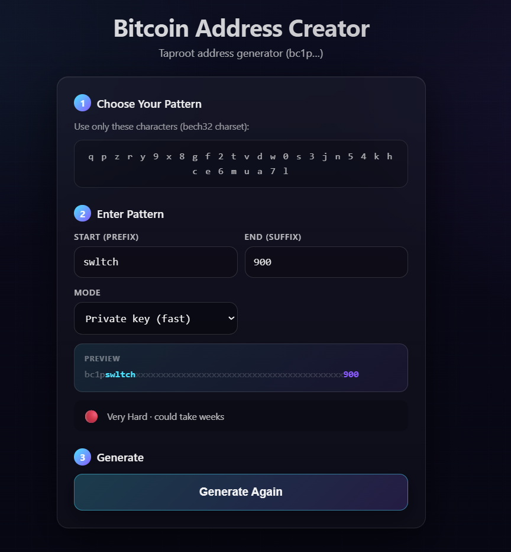
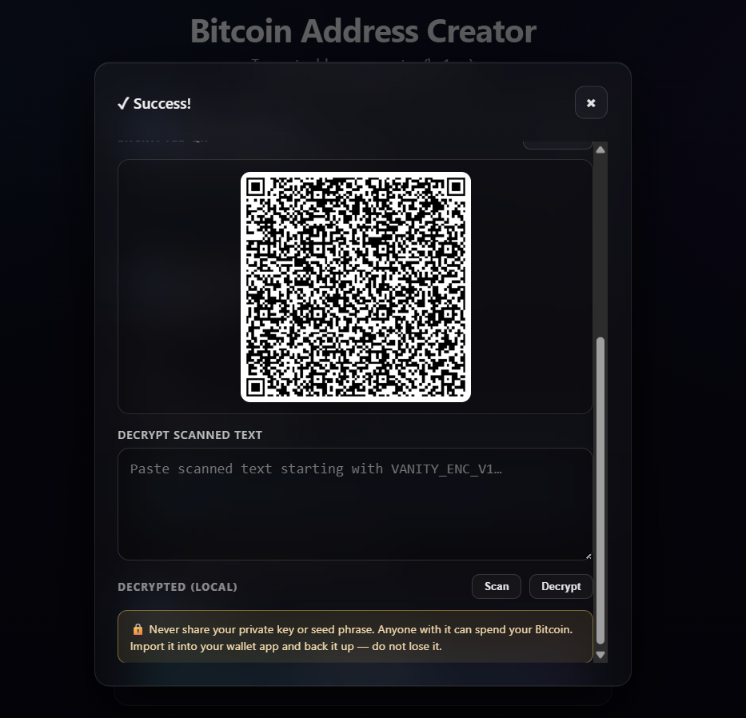
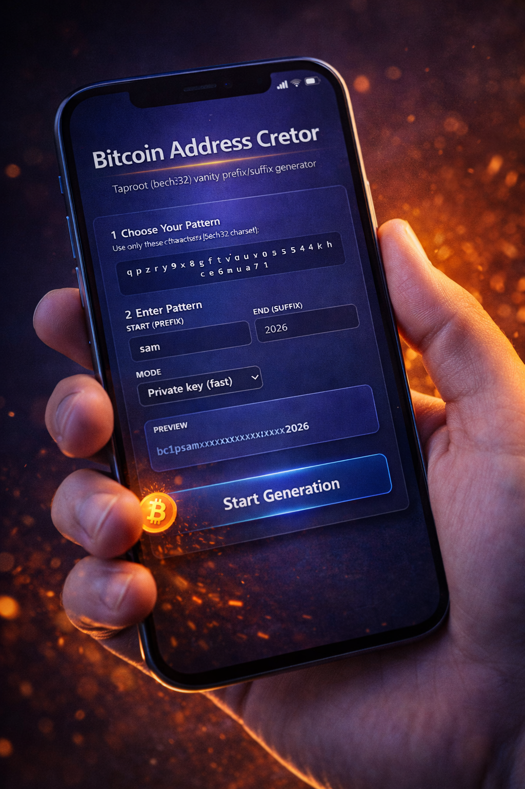

# Bitcoin Address Generator (single-file)

This project is a single-file, client-side vanity Taproot address generator designed to be distributed as one HTML file (see `dist/index.html`).

It helps you generate a Bitcoin Taproot address (and its corresponding secret material) where the address matches a pattern you choose (prefix and/or suffix) while staying entirely in the browser.

## What the app is for

- Generate a Taproot address whose Bech32 address text starts/ends with characters you want (a “vanity” pattern).
- Optionally generate/handle secret material (private key and/or seed phrase) needed to import the address into a wallet.
- Provide mobile-friendly QR flows for:
  - Address QR
  - Encrypted secret QR that deep-links back into the app for decrypting on-device

## How it works (high level)

- You choose an output mode (e.g., generate a private key + address) and an optional vanity pattern (prefix/suffix).
- The app spawns a Web Worker and brute-forces keys locally until it finds an address that matches the requested pattern.
  - This can be fast for short patterns and can take a very long time for longer patterns.
- When a match is found, the app shows the resulting address and (depending on mode) the associated secret.
- Sensitive UI state is wiped when the page is hidden/left to reduce accidental exposure.

### Wordlist / BIP39 checksum correctness

If you use any seed/mnemonic functionality, the app relies on the official 2048-word BIP39 English list and validates that selected/generated mnemonics are checksum-correct so they are importable into wallets.

## Live / Inscribed App

- App inscription (opens the app):
  - https://ordinals.com/content/d99802f6bb3a8b133f25081770dc8eb3d559e8017a0a32cf75b184434c9a96d3i0

## Screenshots

Add PNG screenshots into the `screenshots/` folder using these filenames (then they’ll render here automatically):

## Inscribed Dependencies

### BIP39 English wordlist

The app loads the BIP39 English 2048-word list from an inscription to avoid bundling a large wordlist in the JS bundle.

- Inscription id used by the app:
  - `aca5e63ee6292f0de402adf6603072eceaad3872e7fa3e91b91bf40d95c75875i0`
- Source in code:
  - `src/constants.js` (`BIP39_WORDLIST_INSCRIPTION_ID`)
- Loading behavior:
  - tries `/content/<id>` first
  - falls back to `https://ordinals.com/content/<id>`
  - optional offline fallback: if you embed the wordlist into the `#embeddedBip39Wordlist` element in `index.html` (one word per line), the app can run without fetching

### QR code library

QR rendering uses an inscribed QR library:

- Script URL used by the app:
  - `/content/6f3ff06fb6414bf40c1dac14c3a78fd3979476467cf8a0e5f107c79e9455fc02i0`
- The library was inscribed from:
  - https://larsjung.de/jquery-qrcode

For local development only, `index.html` also includes a dev-only CDN fallback script tag which is stripped from the production single-file build.

## Encrypted Secret QR (Deep Link)

When you generate the encrypted secret QR, the QR contains an `https://...` link back to this app with the encrypted payload embedded in the URL fragment.

- Format:
  - `https://ordinals.com/content/<app-id>#venc=<base64url(utf8("VANITY_ENC_V1\n{json}"))>`
- Why fragment (`#...`) is used:
  - URL fragments are not sent to servers in HTTP requests, so the encrypted payload is not included in normal request logs.
- On open:
  - the app auto-imports the payload into the decrypt box and focuses the password input
  - then clears the fragment from the URL bar via `history.replaceState(...)`

### How the QR workflow is used

- Desktop/laptop flow:
  - Generate an address/secret.
  - Open the Secret QR panel.
  - Enter a password and click **Generate**.
  - The rendered QR is a deep-link URL.
- Phone flow:
  - Scan the encrypted QR with your phone camera.
  - Your phone opens the app automatically.
  - The app auto-fills the encrypted payload into the decrypt box.
  - You enter the password and click **Decrypt** (decrypt happens locally in the browser).

The in-app scanner can also scan QR codes and will accept either:
- a raw `VANITY_ENC_V1\n{json}` payload, or
- a deep-link URL that contains the payload in `#venc=...`.

### Encryption method (spec)

The app uses the WebCrypto API to encrypt the secret with a password using:

- KDF: PBKDF2 with SHA-256
  - iterations: `200000`
  - salt: 16 random bytes (`crypto.getRandomValues`)
- Cipher: AES-256-GCM
  - key size: 256-bit
  - IV/nonce: 12 random bytes (`crypto.getRandomValues`)

The encrypted payload is stored as JSON and then wrapped in a plain-text header:

- Plain-text envelope format:
  - `VANITY_ENC_V1\n{json}`
- JSON fields:
  - `v`: payload version (currently `1`)
  - `kdf`: `"PBKDF2-SHA256"`
  - `iter`: iteration count
  - `cipher`: `"AES-256-GCM"`
  - `salt`: base64url(salt bytes)
  - `iv`: base64url(iv bytes)
  - `ct`: base64url(ciphertext bytes)

Finally, that envelope text is UTF-8 encoded and base64url-encoded again for embedding into the URL fragment:

- `#venc = base64url(utf8("VANITY_ENC_V1\n{json}"))`

Security notes:
- The password is the security boundary; choose a strong password (long, unique, non-dictionary).
- AES-GCM provides confidentiality and integrity (wrong password/corruption results in decrypt failure).
- The payload is encrypted, but it’s still sensitive metadata; keep it private and prefer scanning in a safe environment.

Notes:
- Very dense/large QRs can be harder to scan on some phones.
- Some QR scanner apps may strip the fragment; in that case the app opens but won’t auto-load the payload.

## Security & privacy notes (practical)

- Generation and encryption/decryption are performed locally in the browser.
- The encrypted secret QR is an `https://` link so phone scanners typically open it automatically.
- The encrypted payload is stored in the URL fragment (`#venc=...`) so it is not sent as part of normal HTTP requests.
- Treat the output as sensitive:
  - Never share your seed/private key.
  - Prefer using this on a trusted device.
  - Back up secrets safely if you plan to use the generated wallet.

## Build

- Install deps: `npm install`
- Dev server: `npm run dev`
- Production single-file build: `npm run build`

The build outputs a single file:
- `dist/index.html`
